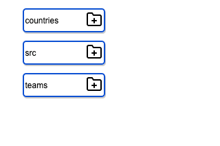
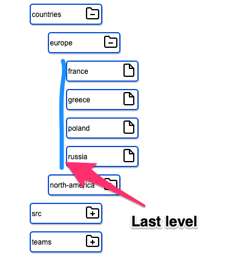

# Recursive render

Recursion is something we can use when building front end applications as well, it sometimes it is the best and most elegant solution.
Since React is just a function we can use recursion to render our elements on the page.

## Recursive folder structure

